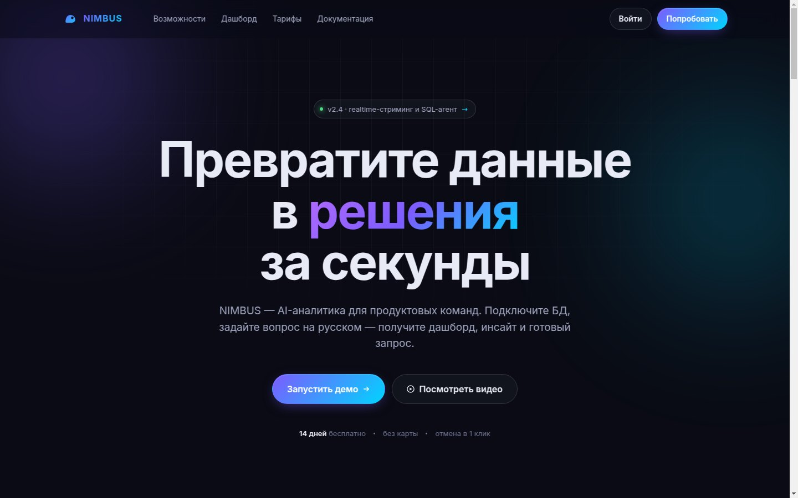
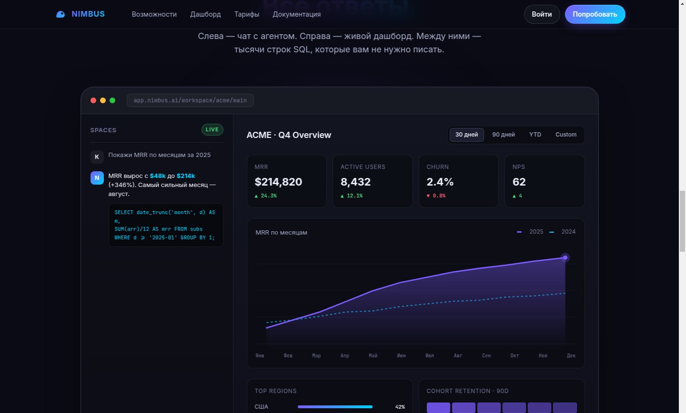

# NIMBUS — лендинг AI-аналитики для SaaS-команд

Лендинг для портфолио в современной dark-mode SaaS-эстетике. Без фреймворков и сборщиков.

🔗 **Live demo:** [enjf8n.github.io/nimbus-saas](https://enjf8n.github.io/nimbus-saas/)



---

## ⚡ Что внутри

7 секций, всё свёрстано вручную:

| № | Секция | Что демонстрирует |
|---|---|---|
| 1 | **Hero** | Gradient-заголовок, фоновые glow'ы и сетка на mask-image, badge с changelog |
| 2 | **Trusted by** | Лого-полоса «клиентов» |
| 3 | **Features** | 4 карточки с inline SVG-иконками и gradient borders (через `mask-composite`) |
| 4 | **Dashboard preview** | Фейковый «живой» дашборд (CSS+SVG-мок) — главный блок |
| 5 | **Stats** | 4 крупных числа с gradient-текстом |
| 6 | **Pricing** | 3 тарифа, центральный — featured с gradient-границей |
| 7 | **CTA + Footer** | Финальный призыв и футер |



---

## 🛠️ Стек

- **HTML5** — семантические теги, accessible-разметка
- **CSS3** — custom properties, Grid, Flexbox, `clamp()`, `backdrop-filter`, `mask-image`, gradient borders
- **Vanilla JS** — `IntersectionObserver` для reveal-анимаций, sticky-nav с blur, smooth-scroll, parallax
- **Inline SVG** — логотип, иконки фич, чарт MRR (две линии 2024/2025 + area gradient)
- **Google Fonts** — Inter (UI) + JetBrains Mono (код)

Никаких сборщиков, npm, бандлеров. 3 файла + README.

---

## 🚀 Запуск локально

```bash
cd nimbus-saas
python3 -m http.server 8000
# открыть http://localhost:8000
```

Или открыть `index.html` напрямую — всё работает с `file://`.

---

## 📦 Деплой на GitHub Pages

1. Залить файлы в репозиторий
2. **Settings → Pages → Source: `main` branch → `/` (root)**
3. Через 1-2 минуты сайт доступен по `https://<username>.github.io/<repo>/`

---

## 📐 Адаптив

- **Desktop:** ≥1024px — full layout
- **Tablet:** 768–1023px — features в одну колонку, pricing в одну колонку
- **Mobile:** ≤767px — burger-меню, моноколоночные стат-блоки, dashboard reflow
- **Compact:** ≤480px — уменьшенный hero-шрифт, сжатые карточки

---

## 📁 Структура

```
nimbus-saas/
├── index.html          # разметка
├── styles.css          # стили (dark theme + responsive)
├── script.js           # IntersectionObserver, parallax, smooth-scroll
├── preview/            # скриншоты для README
│   ├── hero.jpg
│   └── dashboard.jpg
└── README.md
```

---

## 🎨 Палитра

```css
--bg: #0A0B14;      /* основной фон */
--surface: #12141F; /* карточки */
--primary: #7C5CFF; /* фиолетовый акцент */
--accent: #00D4FF;  /* циан акцент */
--green: #4ADE80;   /* успех / плюсы */
```

Gradient: `linear-gradient(135deg, #B66BFF 0%, #7C5CFF 50%, #00D4FF 100%)`.
